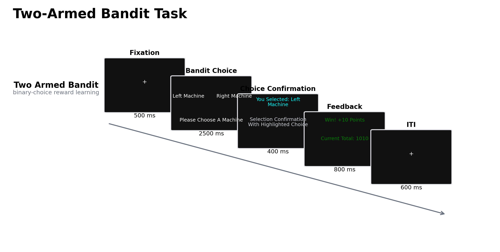

# 双臂老虎机任务：概率强化学习、探索—利用调节及其测量边界

在结果概率未知且只能通过选择后的反馈逐步学习时，决策者必须同时解决两个问题：依据既往结果估计各选项的价值，以及决定继续选择当前优势选项还是采样信息不足的选项。前者属于概率强化学习，后者构成探索—利用权衡。双臂老虎机任务（two-armed bandit task）以两个可重复选择的选项、随机结果和有限试次数构成这一问题的最小实验形式。其简洁性使选择序列能够用强化学习、贝叶斯推断或启发式策略进行逐试次建模，也使参数设置对构念解释具有决定性影响。

双臂任务并非单一标准化量表。选项概率可以在一个区块内固定、在隐蔽变化点反转，或连续漂移；研究者也可以操纵可用试次数、反馈信息和结果效价。因此，同一名称下的任务可能分别强调初始价值学习、反转后的认知灵活性、环境波动性估计或探索策略。对实验结果的解释必须落实到概率结构、变化是否可预期、选择阶段与反馈阶段的具体指标，而不能把所有非优势选择一概归为“探索”。

## 1. 范式起源与理论问题

老虎机问题源于序贯实验设计。Robbins（1952）将资源在多个未知收益分布之间逐次分配的问题形式化：每次选择既产生即时收益，也改变后续决策所依据的信息。有限时域内最大化累计收益由此要求在信息采样与当前收益之间取舍。双臂版本保留了这一核心矛盾，同时减少选项数量，便于对价值差异、选择惯性和反馈效应进行识别。

实验心理学中的主要发展，是把抽象收益分布转化为可控的概率反馈序列，并将可观察选择与潜在计算变量连接。经典增量学习模型以选择后奖励预测误差（reward prediction error, RPE）更新所选行动价值：误差为实际结果与预期价值之差，学习率决定单次反馈改变价值估计的幅度，软最大选择规则的逆温度则描述选择对估计价值差异的敏感性。两选项工具性学习研究表明，纹状体 BOLD 信号随模型估计的 RPE 变化，且多巴胺药理操纵同时改变该信号和优势选项选择率（Pessiglione et al., 2006）。该结果支持 RPE 作为价值更新信号，但不能据此将任一拟合学习率直接视为多巴胺功能的个体指标。

另一条发展线索将“探索”进一步分解。多选项漂移老虎机研究首先以计算策略标记探索选择，并发现额极皮层与顶内沟在探索选择中活动增强，而腹内侧前额叶和纹状体更符合基于价值的利用性选择（Daw et al., 2006）。随后，地平线任务通过操纵当前游戏剩余试次数证明，人类同时增加对不确定选项的定向探索和与不确定性无关的随机探索（Wilson et al., 2014）。对两臂或多臂任务的建模因而逐渐从单一“噪声”参数转向相对不确定性、总不确定性、选择随机性与价值学习精度的区分（Gershman, 2018; Speekenbrink & Konstantinidis, 2015）。

## 2. 任务逻辑、操作变体与指标

典型试次包含选择呈现、按键或眼动选择、短暂确认、结果反馈和试次间隔。每个选项对应一个未知的奖励分布；二元结果设计通常按伯努利分布生成奖励或无奖励，连续结果设计则从不同均值与方差的分布采样。参与者通常只看到已选择选项的结果，因此未选选项的价值必须依赖先验、遗忘或主动采样来估计。选择阶段的价值差、相对不确定性和反应时可用于分析行动选择；反馈阶段的结果效价、RPE 和意外程度用于分析学习；反转后连续选择旧优势项的次数、重新达到优势选择标准所需试次及模型估计的变化点信念，则用于分析适应。

固定概率区块适合估计从无信息状态到稳定偏好的获得过程。若区块中途不提示地交换高、低收益选项，反转后的行为还取决于参与者能否从随机负反馈中推断环境状态已改变。隐马尔可夫或贝叶斯变化点模型可以把“状态切换”与缓慢价值更新区分开；猕猴两臂反转研究发现，行为更符合对隐状态的快速推断，背外侧前额叶群体活动能够编码选择偏好的切换（Bartolo & Averbeck, 2020）。若反转由达到连续优势选择标准触发，反转次数会与赢后保持策略发生结构性耦合；按固定区块安排反转可削弱这种依赖，但显式区块边界也可能使状态重置变得可预期（Swanson et al., 2022）。

连续漂移或无提示变化点提高了生态有效性，同时扩大了模型等价性。较高学习率可能表示对波动性的合理适应，也可能来自较短记忆、注意波动或结果序列偶然性。Lee 等（2023）在两个大样本两臂任务数据集中分离了选择探索噪声与学习精度，发现意外不确定性增加时，选择更易变而价值学习反而更精确。这表明“行为变得随机”不足以推出学习受损；环境统计、价值估计和选择规则需要联合建模。

常用描述性指标包括优势选项选择率、累计收益、赢后保持/输后转换比例、选择转换率和反应时。模型指标通常包括正、负反馈学习率、逆温度、遗忘或选择黏着参数以及不确定性奖励。模型比较、后验预测检验和参数恢复是必要步骤，因为相同的选择率可由低学习率、高探索、空间偏好或偶发漏答产生。尤其在固定二元概率下，单次未奖励并不等于选择错误，按客观结果把试次简单编码为“正确/错误”会混淆概率反馈与决策质量。

## 3. 行为与神经科学证据

### 3.1 价值学习、探索与反转适应

两臂任务可同时观察基于近期结果的局部策略和跨试次价值整合。赢后保持/输后转换能够描述直接反馈依赖，但不能说明参与者是否表示了奖励率及其不确定性。Harlé 等（2015）比较了动态贝叶斯学习与多种决策规则；甲基苯丙胺依赖组更常表现为赢后保持/输后转换，而健康组更符合整合既往结果的软最大策略。不过每组仅 16 人，该结果说明计算分解可能揭示群体策略差异，尚不足以建立临床分类器。

不确定性操纵提高了探索构念的可识别性。相对不确定性指两个选项估计不确定性的差异，理论上应把选择定向推向信息较少的选项；总不确定性则可扩大内部价值样本的变异，表现为随机探索。fMRI 研究分别在右侧额极前额叶和右侧背外侧前额叶发现与相对不确定性、总不确定性相联系的活动，并以模型说明两类信号如何汇入选择计算（Tomov et al., 2020）。这些结果支持探索具有可分计算成分，但 BOLD 相关不能单独证明相应区域的因果作用。TaskBeacon 当前版本没有独立操纵信息量或选择地平线，因而其非优势选择更适合解释为价值学习、选择噪声和偏好惯性的合成结果。

### 3.2 fMRI 与 EEG 所揭示的阶段性过程

概率反转学习将反馈期的价值更新与下一试次的选择准备连接起来。Hampton 和 O'Doherty（2007）发现，前一试次的前扣带、内侧前额叶和腹侧纹状体活动可联合解码随后选择，说明反馈加工后的网络状态包含下一决策相关信息。Daw 等（2006）与 Tomov 等（2020）的结果进一步表明，探索相关活动取决于用于定义探索的计算量。脑区活动差异因此应表述为特定模型变量或条件对比的相关信号，而非稳定的“探索中枢”。

事件相关电位（event-related potential, ERP）提供反馈至下一选择之间的时间证据。两臂任务中，经模型分类的探索选择之前出现较大的反馈锁定 P300，随后选择刺激诱发的 N200 也增强；奖励正波并未随探索而增强，提示反馈后的注意重定向与选择冲突可能先后参与探索决策（Hassall, McDonald, et al., 2019）。另一项 500 人研究系统刻画了两臂任务中奖励正波、δ 与 θ 频段的反馈效应，并指出成分定义和分析方法会改变估计结果（Williams et al., 2021）。奖励正波还依赖参与者的选择与行动代理感；删除线索、选择或行动会显著削弱该成分（Hassall, Hajcak, et al., 2019）。因此，反馈锁定 ERP 适合检验结果评价的时间进程，但头皮信号不提供精确空间定位，且效价、意外程度、代理感和后续行为调整需要在设计或回归中分离。

## 4. 方法发展与应用范围

该范式的应用已从一般成人扩展至发展、老化、成瘾与精神病理研究，也延伸到动物跨物种模型。其优势在于任务生成过程可明确表达，选择序列可与同一计算模型对接；临床价值主要体现为检验特定学习假设，而非凭单个参数诊断个体。固定区块反转的动物研究显示，去甲肾上腺素系统扰动选择性改变对正反馈的敏感性，并证明准确率可以与赢后保持相分离（Swanson et al., 2022）。这类因果证据帮助界定过程，但物种、奖励类型和操作方法限制了对人类临床样本的直接外推。

任务也被用于比较不同呈现结构。延长地平线能够增加信息的未来价值，反转或漂移提高环境变化率，全反馈则直接消除对未选选项的部分不确定性。上述改动会同时改变表面难度、探索的规范收益与模型可识别性。研究问题若聚焦奖励获得，应采用稳定概率并保证足够学习试次；若聚焦变化检测，应使用未提示反转并估计变化点信念；若聚焦定向与随机探索，则需正交操纵相对不确定性和总不确定性。

## 5. 测量效度、可靠性与解释边界

双臂任务在群体水平通常能产生学习曲线和概率差异效应，但稳定的平均效应不保证可靠的个体排序。Schaaf 等（2024）在相隔五周的在线测量中发现，两臂老虎机模型参数的组内相关系数约为 .02–.52，整体偏低；情绪状态解释了部分个体内波动。Kalender 等（2025）在 179 名精神病谱系患者与未诊断对照中报告，描述性行为与计算参数的重测信度均为差至中等（约 .24–.61），模型参数并未稳定优于直接行为指标。由此，学习率或选择噪声可用于群体机制检验，但在没有任务优化、参数恢复和独立验证时，不宜作为个体诊断或疗效判定依据。

构念效度还受选项表征和反馈制度影响。固定左右位置使价值偏好与运动、空间偏侧难以完全分离；只显示已选结果会把信息寻求与收益寻求绑定；区块边界、概率差和试次数决定反转能否被识别；积分是否兑换实际金钱会改变奖励动机。模型拟合也不自动消除这些混淆。研究者应预注册候选模型与排除规则，报告生成性参数恢复和模型比较，并分别呈现自主选择、超时及补选试次。若任务不含显式不确定性或地平线操纵，最稳妥的结论是概率反馈下的选择适应，而不是对定向探索、随机探索或神经递质功能作强推断。

## 6. TaskBeacon 中的任务实现

### 6.1 任务资源与访问入口

| 资源 | ID | 用途 | 地址 |
|---|---|---|---|
| 桌面实验实现 | T000038 | PsychoPy/PsyFlow 行为实验源码 | [GitHub 仓库](https://github.com/TaskBeacon/T000038-two-armed-bandit) |
| 浏览器伴随版本 | H000038 | 同结构的行为预览源码 | [GitHub 仓库](https://github.com/TaskBeacon/H000038-two-armed-bandit) |
| 公开体验入口 | H000038 | 浏览器中运行预览任务 | [TaskBeacon Preview](https://taskbeacon.github.io/psyflow-web/?task=H000038-two-armed-bandit) |

浏览器版保持 4 区块、160 试次、按键映射和概率序列，用于行为流程预览；其初始积分为 1000，而桌面实现的累计积分从 0 开始。浏览器运行时不输出桌面实验的外部硬件事件，因此不能视为需要同步采集时的等价替代。

### 6.2 实现流程与关键参数

TaskBeacon 当前版本包含 4 个区块，每区块 40 试次。左右选项的奖励概率依次为 .75/.25、.25/.75、.65/.35 和 .35/.65，区块内固定且区块间交换优势侧，同时后两区块缩小概率差。每次选择仅对所选侧按相应概率作伯努利抽样；中奖增加 10 分，未中奖增加 0 分。主要记录量包括选择侧、选择反应时、是否中奖、单试次得分与累计得分。现有仓库文件无法确认积分是否兑换为实际金钱。

**图 1. TaskBeacon 双臂老虎机任务的区块与试次流程。** 四个区块均按“选择前注视 500 ms—双选项选择 2500 ms—选择确认 400 ms—结果反馈 800 ms—试次间隔 600 ms”运行；F/J 分别映射左/右机器，确认阶段高亮所选机器。区块 1–4 的左/右中奖概率依次为 .75/.25、.25/.75、.65/.35、.35/.65；反馈显示中奖 +10 分或未中奖 +0 分及累计分数。任务不使用自适应控制器，概率在区块内不随表现改变。2500 ms 内未作答时按随机策略补选并继续计分，故分析自主选择和反应时时应使用补选标记加以区分。

显式区块休息使概率转换发生在可识别边界，当前实现更适合研究区块化概率学习和边界后的重新获得，而非隐蔽变化点检测。左右机器身份不换位且概率顺序固定，空间偏好和顺序效应应在分析中作为备择解释。全部阶段采用固定时长，适合标准化行为采集；若用于事件相关神经影像，仍需依据目标对比评估时序去卷积需求。

## 参考文献

Bartolo, R., & Averbeck, B. B. (2020). Prefrontal cortex predicts state switches during reversal learning. *Neuron, 106*(6), 1044–1054.e4. https://doi.org/10.1016/j.neuron.2020.03.024

Daw, N. D., O'Doherty, J. P., Dayan, P., Seymour, B., & Dolan, R. J. (2006). Cortical substrates for exploratory decisions in humans. *Nature, 441*(7095), 876–879. https://doi.org/10.1038/nature04766

Gershman, S. J. (2018). Deconstructing the human algorithms for exploration. *Cognition, 173*, 34–42. https://doi.org/10.1016/j.cognition.2017.12.014

Hampton, A. N., & O'Doherty, J. P. (2007). Decoding the neural substrates of reward-related decision making with functional MRI. *Proceedings of the National Academy of Sciences, 104*(4), 1377–1382. https://doi.org/10.1073/pnas.0606297104

Harlé, K. M., Zhang, S., Schiff, M., Mackey, S., Paulus, M. P., & Yu, A. J. (2015). Altered statistical learning and decision-making in methamphetamine dependence: Evidence from a two-armed bandit task. *Frontiers in Psychology, 6*, Article 1910. https://doi.org/10.3389/fpsyg.2015.01910

Hassall, C. D., Hajcak, G., & Krigolson, O. E. (2019). The importance of agency in human reward processing. *Cognitive, Affective, & Behavioral Neuroscience, 19*(6), 1458–1466. https://doi.org/10.3758/s13415-019-00730-2

Hassall, C. D., McDonald, C. G., & Krigolson, O. E. (2019). Ready, set, explore! Event-related potentials reveal the time-course of exploratory decisions. *Brain Research, 1719*, 183–193. https://doi.org/10.1016/j.brainres.2019.05.039

Kalender, G., Olsen, S. T., Patzelt, E. H., Barch, D. M., Carter, C. S., Gold, J. M., Ragland, J. D., Silverstein, S. M., MacDonald, A. W., & Widge, A. S. (2025). Test–retest reliability of computational parameters versus manifest behavior for decisional flexibility in psychosis. *Psychological Assessment, 37*(6–7), 273–287. https://doi.org/10.1037/pas0001383

Lee, J. K., Rouault, M., & Wyart, V. (2023). Adaptive tuning of human learning and choice variability to unexpected uncertainty. *Science Advances, 9*(13), Article eadd0501. https://doi.org/10.1126/sciadv.add0501

Pessiglione, M., Seymour, B., Flandin, G., Dolan, R. J., & Frith, C. D. (2006). Dopamine-dependent prediction errors underpin reward-seeking behaviour in humans. *Nature, 442*(7106), 1042–1045. https://doi.org/10.1038/nature05051

Robbins, H. (1952). Some aspects of the sequential design of experiments. *Bulletin of the American Mathematical Society, 58*(5), 527–535. https://doi.org/10.1090/S0002-9904-1952-09620-8

Schaaf, J. V., Weidinger, L., Molleman, L., & van den Bos, W. (2024). Test–retest reliability of reinforcement learning parameters. *Behavior Research Methods, 56*(5), 4582–4599. https://doi.org/10.3758/s13428-023-02203-4

Speekenbrink, M., & Konstantinidis, E. (2015). Uncertainty and exploration in a restless bandit problem. *Topics in Cognitive Science, 7*(2), 351–367. https://doi.org/10.1111/tops.12145

Swanson, K., Averbeck, B. B., & Laubach, M. (2022). Noradrenergic regulation of two-armed bandit performance. *Behavioral Neuroscience, 136*(1), 84–99. https://doi.org/10.1037/bne0000495

Tomov, M. S., Truong, V. Q., Hundia, R. A., & Gershman, S. J. (2020). Dissociable neural correlates of uncertainty underlie different exploration strategies. *Nature Communications, 11*(1), Article 2371. https://doi.org/10.1038/s41467-020-15766-z

Williams, C. C., Ferguson, T. D., Hassall, C. D., Abimbola, W., & Krigolson, O. E. (2021). The ERP, frequency, and time–frequency correlates of feedback processing: Insights from a large sample study. *Psychophysiology, 58*(2), Article e13722. https://doi.org/10.1111/psyp.13722

Wilson, R. C., Geana, A., White, J. M., Ludvig, E. A., & Cohen, J. D. (2014). Humans use directed and random exploration to solve the explore–exploit dilemma. *Journal of Experimental Psychology: General, 143*(6), 2074–2081. https://doi.org/10.1037/a0038199
